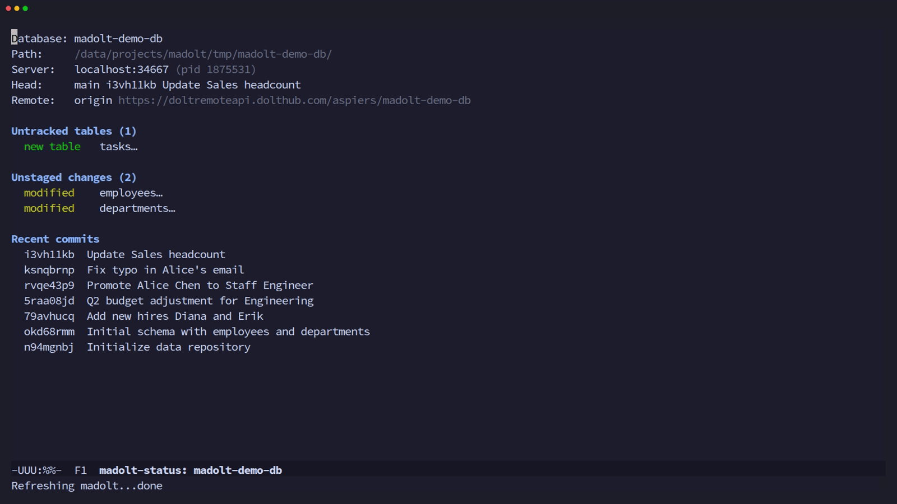
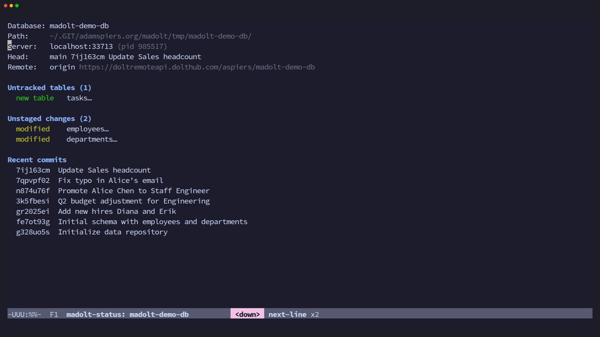
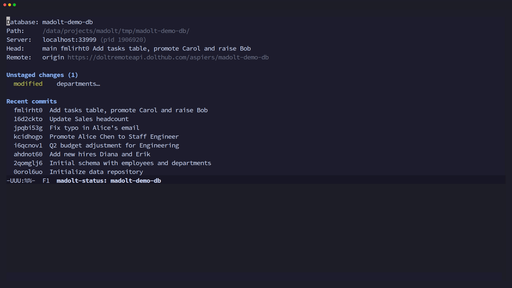
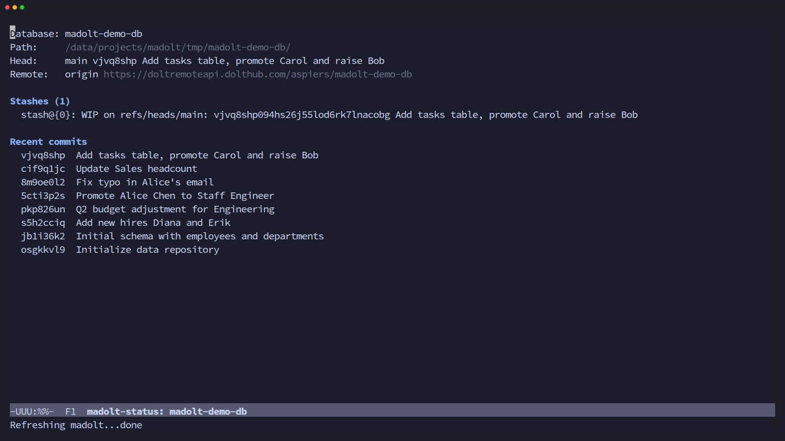

# madolt

A [magit](https://magit.vc/)-like Emacs interface for the
[Dolt](https://www.dolthub.com/blog/2020-03-06-so-you-want-a-git-database/)
version-controlled database.

Madolt provides a section-based, keyboard-driven UI for Dolt's
Git-like version control operations on SQL databases.  The core
workflow is: **view status -> stage tables -> commit -> view
history**.

### Overview & diffs


### Stage, commit, log, refs & branch


### Stash & interactive rebase


### Merge, conflicts, blame, SQL & server


## Features

### Core workflow
- **Status buffer** -- current branch, upstream, merge conflicts,
  staged/unstaged/untracked tables, stashes, unpushed/unpulled
  commits, and recent commits (like `magit-status`); section
  visibility preserved across refreshes
- **Stage/unstage/discard/clean** -- operate on tables at point or
  stage/unstage all at once (Dolt stages whole tables, not hunks)
- **Commit** with transient arguments (`--all`, `--ALL`, `--amend`,
  `--allow-empty`, `--force`, `--date`, `--author`); commit message
  via minibuffer with history (`M-p`/`M-n`)

### Viewing changes
- **Tabular diff viewer** -- Dolt diffs are row-level and cell-level,
  not line-based text; madolt renders them in structured mode
  (collapsible row sections with cell-level highlighting) or raw
  tabular mode
- **Log viewer** -- navigable commit history with collapsible
  sections; `TAB` shows stat output inline, `RET` shows the full
  revision with diff
- **Reflog** -- view and navigate the reference log
- **Blame** -- per-table blame showing commit attribution per row

### Branching and history
- **Branch management** -- checkout, create, delete, rename
- **Merge** with arguments (`--no-ff`, `--ff-only`, `--squash`,
  `--no-commit`) and abort
- **Rebase** with interactive and empty-commit flags, continue/abort
- **Cherry-pick** and **revert** commits
- **Reset** -- soft (move HEAD), hard (reset everything), mixed
  (unstage all)
- **Tag** -- create, delete, and list tags
- **Stash** -- create, pop, drop, and clear stashes

### Remote operations
- **Fetch** from origin or other remotes (with prune)
- **Pull** with `--ff-only`, `--no-ff`, `--squash`
- **Push** with `--force`, `--set-upstream`
- **Remote management** -- add/remove remotes

### Inspecting and utilities
- **SQL query interface** -- run arbitrary SQL queries from Emacs
- **Conflict resolution** -- view conflict details (base/ours/theirs)
  and resolve by taking ours or theirs
- **Process buffer** -- view all Dolt CLI invocations and their output
  (like magit's `$` buffer)
- **Copy section value** -- `w` copies table name or commit hash to
  kill ring
- **Dispatch menu** -- transient-based top-level menu for all commands

## Requirements

- Emacs >= 29.1
- [Dolt](https://docs.dolthub.com/introduction/installation) >= 1.0
- Emacs packages:
  - [magit-section](https://melpa.org/#/magit-section) >= 4.0
  - [transient](https://melpa.org/#/transient) >= 0.7
  - [with-editor](https://melpa.org/#/with-editor) >= 3.0
  - [compat](https://melpa.org/#/compat) >= 30.1

## Installation

### straight.el

```elisp
(straight-use-package
 '(madolt :type git :host github :repo "aspiers/madolt"))
```

### use-package + straight.el

```elisp
(use-package madolt
  :straight (:host github :repo "aspiers/madolt")
  :commands (madolt-status madolt-dispatch))
```

### Manual

Clone the repository and add it to your `load-path`:

```elisp
(add-to-list 'load-path "/path/to/madolt")
(require 'madolt)
```

### Suggested keybinding

```elisp
(keymap-global-set "C-x D" #'madolt-status)
```

## Usage

Open a Dolt database directory and run:

    M-x madolt-status

This opens the status buffer showing the current branch, staged
changes, unstaged changes, untracked tables, and recent commits.

From any madolt buffer, press `?` or `h` to open the dispatch menu.

## Keybindings

### Status buffer

| Key     | Command                  | Description                         |
|---------|--------------------------|-------------------------------------|
| `g`     | refresh                  | Refresh the current buffer          |
| `q`     | quit-window              | Close the buffer                    |
| `?`/`h` | madolt-dispatch          | Show dispatch menu                  |
| `s`     | madolt-stage             | Stage the table at point            |
| `S`     | madolt-stage-all         | Stage all tables                    |
| `u`     | madolt-unstage           | Unstage the table at point          |
| `U`     | madolt-unstage-all       | Unstage all tables                  |
| `k`     | madolt-discard           | Discard changes to table at point   |
| `x`     | madolt-clean             | Remove untracked table at point     |
| `b`     | madolt-branch            | Branch transient menu               |
| `c`     | madolt-commit            | Commit transient menu               |
| `d`     | madolt-diff              | Diff transient menu                 |
| `l`     | madolt-log               | Log transient menu                  |
| `m`     | madolt-merge             | Merge transient menu                |
| `r`     | madolt-rebase            | Rebase transient menu               |
| `t`     | madolt-tag               | Tag transient menu                  |
| `z`     | madolt-stash             | Stash transient menu                |
| `A`     | madolt-cherry-pick       | Cherry-pick transient menu          |
| `V`     | madolt-revert            | Revert transient menu               |
| `X`     | madolt-reset             | Reset transient menu                |
| `B`     | madolt-blame             | Blame a table                       |
| `C`     | madolt-conflicts         | Conflict resolution menu            |
| `e`     | madolt-sql-query         | Run a SQL query                     |
| `f`     | madolt-fetch             | Fetch transient menu                |
| `F`     | madolt-pull              | Pull transient menu                 |
| `P`     | madolt-push              | Push transient menu                 |
| `M`     | madolt-remote-manage     | Remote management menu              |
| `w`     | madolt-copy-section-value| Copy section value to kill ring     |
| `$`     | madolt-process-buffer    | Show the process log buffer         |
| `RET`   | madolt-visit-thing       | Visit the thing at point            |
| `TAB`   | toggle section           | Expand/collapse the current section |

### Branch transient (`b`)

| Key | Command                           |
|-----|-----------------------------------|
| `b` | Checkout branch                   |
| `c` | Create & checkout new branch      |
| `n` | Create branch (no checkout)       |
| `k` | Delete branch                     |
| `m` | Rename branch                     |

### Commit transient (`c`)

| Key  | Command / Argument                      |
|------|-----------------------------------------|
| `c`  | Create commit                           |
| `a`  | Amend last commit                       |
| `m`  | Edit commit message only                |
| `-a` | Stage all modified/deleted tables       |
| `-A` | Stage all tables (including new)        |
| `-e` | Allow empty commit                      |
| `-f` | Force (ignore constraint warnings)      |
| `=d` | Override date                           |
| `=A` | Override author                         |

### Diff transient (`d`)

| Key  | Command / Argument        |
|------|---------------------------|
| `d`  | Working tree diff         |
| `s`  | Staged diff               |
| `c`  | Diff between two commits  |
| `t`  | Single table diff         |
| `r`  | Raw tabular mode          |
| `-s` | Statistics only           |
| `-S` | Summary only              |
| `-w` | Where clause filter       |
| `-k` | Skinny columns            |

### Log transient (`l`)

| Key  | Command / Argument     |
|------|------------------------|
| `l`  | Current branch log     |
| `o`  | Other branch log       |
| `h`  | HEAD log               |
| `O`  | Current branch reflog  |
| `p`  | Other ref reflog       |
| `-n` | Limit count            |
| `-s` | Show stat              |
| `-m` | Merges only            |
| `-g` | Graph                  |

### Merge transient (`m`)

| Key  | Command / Argument     |
|------|------------------------|
| `m`  | Merge                  |
| `a`  | Abort merge            |
| `-n` | No fast-forward        |
| `-f` | Fast-forward only      |
| `-s` | Squash                 |
| `-c` | No commit              |

### Rebase transient (`r`)

| Key  | Command / Argument     |
|------|------------------------|
| `r`  | Rebase onto            |
| `c`  | Continue               |
| `a`  | Abort                  |
| `-i` | Interactive            |
| `-e` | Empty commits: keep    |

### Reset transient (`X`)

| Key | Command              |
|-----|----------------------|
| `s` | Soft reset           |
| `h` | Hard reset           |
| `m` | Mixed (unstage all)  |

### Cherry-pick transient (`A`)

| Key  | Command / Argument   |
|------|----------------------|
| `A`  | Cherry-pick          |
| `a`  | Abort                |
| `-e` | Allow empty          |

### Tag transient (`t`)

| Key  | Command / Argument   |
|------|----------------------|
| `t`  | Create tag           |
| `k`  | Delete tag           |
| `l`  | List tags            |
| `-m` | Message              |

### Stash transient (`z`)

| Key  | Command / Argument          |
|------|-----------------------------|
| `z`  | Stash                       |
| `p`  | Pop                         |
| `k`  | Drop                        |
| `x`  | Clear all                   |
| `-u` | Include untracked           |
| `-a` | All (including ignored)     |

### Fetch (`f`) / Pull (`F`) / Push (`P`)

| Key | Fetch            | Pull             | Push             |
|-----|------------------|------------------|------------------|
| `p` | Fetch from origin| Pull from origin | Push to origin   |
| `e` | Fetch elsewhere  | Pull elsewhere   | Push elsewhere   |

### Remote management (`M`)

| Key | Command          |
|-----|------------------|
| `a` | Add remote       |
| `k` | Remove remote    |

### Conflict resolution (`C`)

| Key | Command          |
|-----|------------------|
| `c` | Show conflicts   |
| `o` | Resolve ours     |
| `t` | Resolve theirs   |

### Section navigation (inherited from magit-section)

| Key       | Command                        |
|-----------|--------------------------------|
| `TAB`     | Toggle current section         |
| `n`       | Next section                   |
| `p`       | Previous section               |
| `M-n`     | Next sibling section           |
| `M-p`     | Previous sibling section       |
| `^`       | Parent section                 |

## Architecture

Madolt is organized as 21 source files (~4,450 LOC) with 21 test
files (~6,030 LOC):

| File                  | Purpose                                     | LOC |
|-----------------------|---------------------------------------------|-----|
| `madolt.el`           | Entry point, defgroup, dispatch transient   | 136 |
| `madolt-dolt.el`      | CLI wrapper: parsing Dolt output            | 492 |
| `madolt-process.el`   | Process execution and logging               | 157 |
| `madolt-mode.el`      | Major mode, buffer lifecycle, refresh       | 285 |
| `madolt-status.el`    | Status buffer with section inserters        | 369 |
| `madolt-apply.el`     | Stage/unstage/discard/clean operations      | 186 |
| `madolt-commit.el`    | Commit transient and minibuffer commit      | 181 |
| `madolt-diff.el`      | Tabular diff viewer (structured + raw)      | 686 |
| `madolt-log.el`       | Commit log viewer and revision buffer       | 482 |
| `madolt-branch.el`    | Branch management transient                 | 115 |
| `madolt-merge.el`     | Merge transient                             | 88  |
| `madolt-rebase.el`    | Rebase transient                            | 91  |
| `madolt-reset.el`     | Reset transient (soft/hard/mixed)           | 101 |
| `madolt-cherry-pick.el`| Cherry-pick and revert transients           | 97  |
| `madolt-remote.el`    | Fetch/pull/push/remote management           | 201 |
| `madolt-stash.el`     | Stash transient                             | 110 |
| `madolt-tag.el`       | Tag transient                               | 98  |
| `madolt-blame.el`     | Per-table blame mode                        | 130 |
| `madolt-conflicts.el` | Conflict resolution UI                      | 187 |
| `madolt-reflog.el`    | Reference log viewer                        | 134 |
| `madolt-sql.el`       | SQL query interface                         | 121 |

## Development

See [CONTRIBUTING.md](CONTRIBUTING.md) for build instructions, running
tests, and known limitations.

## License

GPL-3.0-or-later.  See [LICENSE](LICENSE) for the full text.
