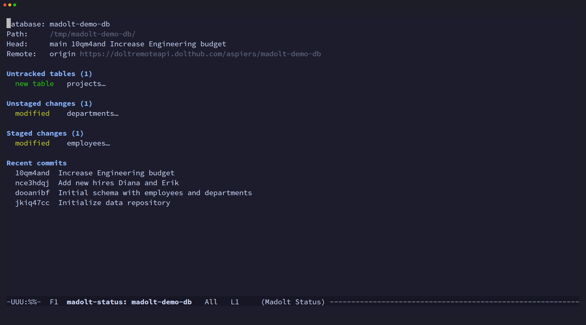

# madolt

A [magit](https://magit.vc/)-like Emacs interface for the
[Dolt](https://www.dolthub.com/blog/2020-03-06-so-you-want-a-git-database/)
version-controlled database.

Madolt provides a section-based, keyboard-driven UI for Dolt's
Git-like version control operations on SQL databases.  The core
workflow is: **view status -> stage tables -> commit -> view
history**.



## Features

- **Status buffer** -- shows current branch, staged/unstaged/untracked
  tables, and recent commits (like `magit-status`)
- **Stage/unstage/discard** -- operate on tables at point or stage all
  at once (Dolt stages whole tables, not hunks)
- **Commit** with transient arguments (--all, --amend, --allow-empty,
  --force, --date, --author); commit message via minibuffer with
  history (M-p/M-n)
- **Tabular diff viewer** -- Dolt diffs are row-level and cell-level,
  not line-based text; madolt renders them in structured mode
  (collapsible row sections with cell-level highlighting) or raw
  tabular mode
- **Log viewer** -- navigable commit history with collapsible sections;
  TAB shows stat output inline, RET shows the full revision with diff
- **Process buffer** -- view all Dolt CLI invocations and their output
  (like magit's `$` buffer)
- **Dispatch menu** -- transient-based top-level menu for all commands

## Requirements

- Emacs >= 29.1
- [Dolt](https://docs.dolthub.com/introduction/installation) >= 1.0
- Emacs packages:
  - [magit-section](https://melpa.org/#/magit-section) >= 4.0
  - [transient](https://melpa.org/#/transient) >= 0.7
  - [with-editor](https://melpa.org/#/with-editor) >= 3.0
  - [compat](https://melpa.org/#/compat) >= 30.1

## Installation

### straight.el

```elisp
(straight-use-package
 '(madolt :type git :host github :repo "aspiers/madolt"))
```

### use-package + straight.el

```elisp
(use-package madolt
  :straight (:host github :repo "aspiers/madolt")
  :commands (madolt-status madolt-dispatch))
```

### Manual

Clone the repository and add it to your `load-path`:

```elisp
(add-to-list 'load-path "/path/to/madolt")
(require 'madolt)
```

### Suggested keybinding

```elisp
(keymap-global-set "C-x D" #'madolt-status)
```

## Usage

Open a Dolt database directory and run:

    M-x madolt-status

This opens the status buffer showing the current branch, staged
changes, unstaged changes, untracked tables, and recent commits.

From any madolt buffer, press `?` or `h` to open the dispatch menu.

## Keybindings

### Status buffer

| Key   | Command              | Description                         |
|-------|----------------------|-------------------------------------|
| `g`   | refresh              | Refresh the current buffer          |
| `q`   | quit-window          | Close the buffer                    |
| `?`/`h` | madolt-dispatch    | Show dispatch menu                  |
| `s`   | madolt-stage         | Stage the table at point            |
| `S`   | madolt-stage-all     | Stage all tables                    |
| `u`   | madolt-unstage       | Unstage the table at point          |
| `U`   | madolt-unstage-all   | Unstage all tables                  |
| `k`   | madolt-discard       | Discard changes to table at point   |
| `c`   | madolt-commit        | Open commit transient menu          |
| `d`   | madolt-diff          | Open diff transient menu            |
| `l`   | madolt-log           | Open log transient menu             |
| `$`   | madolt-process-buffer| Show the process log buffer         |
| `RET` | madolt-visit-thing   | Visit the thing at point            |
| `TAB` | toggle section       | Expand/collapse the current section |

### Dispatch menu (`?` / `h`)

| Key | Command         |
|-----|-----------------|
| `s` | Status          |
| `d` | Diff            |
| `l` | Log             |
| `c` | Commit          |
| `$` | Process buffer  |

### Commit transient (`c`)

| Key  | Command / Argument                      |
|------|-----------------------------------------|
| `c`  | Create commit                           |
| `a`  | Amend last commit                       |
| `m`  | Edit commit message only                |
| `-a` | Stage all modified/deleted tables       |
| `-A` | Stage all tables (including new)        |
| `-e` | Allow empty commit                      |
| `-f` | Force (ignore constraint warnings)      |
| `=d` | Override date                           |
| `=A` | Override author                         |

### Diff transient (`d`)

| Key  | Command / Argument        |
|------|---------------------------|
| `d`  | Working tree diff         |
| `s`  | Staged diff               |
| `c`  | Diff between two commits  |
| `t`  | Single table diff         |
| `r`  | Raw tabular mode          |
| `-s` | Statistics only           |
| `-S` | Summary only              |
| `-w` | Where clause filter       |
| `-k` | Skinny columns            |

### Log transient (`l`)

| Key  | Command / Argument    |
|------|-----------------------|
| `l`  | Current branch log    |
| `o`  | Other branch log      |
| `h`  | HEAD log              |
| `-n` | Limit count           |
| `-s` | Show stat             |
| `-m` | Merges only           |

### Section navigation (inherited from magit-section)

| Key       | Command                        |
|-----------|--------------------------------|
| `TAB`     | Toggle current section         |
| `n`       | Next section                   |
| `p`       | Previous section               |
| `M-n`     | Next sibling section           |
| `M-p`     | Previous sibling section       |
| `^`       | Parent section                 |

## Architecture

Madolt is organized as 9 source files:

| File                | Purpose                                   | LOC |
|---------------------|-------------------------------------------|-----|
| `madolt.el`         | Entry point, defgroup, dispatch transient | 92  |
| `madolt-dolt.el`    | CLI wrapper: parsing Dolt output          | 303 |
| `madolt-process.el` | Process execution and logging             | 161 |
| `madolt-mode.el`    | Major mode, buffer lifecycle, refresh     | 192 |
| `madolt-status.el`  | Status buffer with section inserters      | 260 |
| `madolt-apply.el`   | Stage/unstage/discard operations          | 136 |
| `madolt-commit.el`  | Commit transient and minibuffer commit    | 181 |
| `madolt-diff.el`    | Tabular diff viewer (structured + raw)    | 500 |
| `madolt-log.el`     | Commit log viewer and revision buffer     | 322 |

## Development

See [CONTRIBUTING.md](CONTRIBUTING.md) for build instructions, running
tests, and known limitations.

## License

GPL-3.0-or-later.  See [LICENSE](LICENSE) for the full text.
